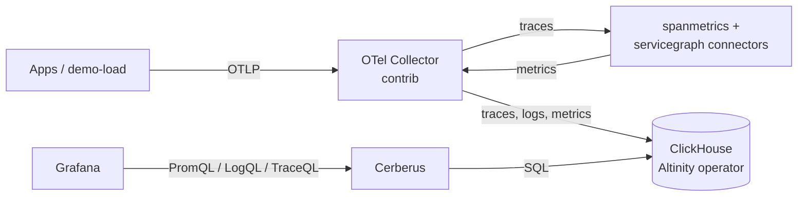

# ClickHouse observability stack (Argo CD app-of-apps)

A GitOps deployment of an OpenTelemetry pipeline that stores **traces, logs and metrics in ClickHouse** and lets **Grafana query them with PromQL, LogQL and TraceQL**. Grafana doesn't talk to ClickHouse directly: Cerberus sits in between and speaks the Prometheus, Loki and Tempo APIs on ClickHouse's behalf.

One Argo CD app-of-apps chart deploys everything else, per environment. Every workload is its own small chart under `cluster-nodes/`, and all of them render their Kubernetes objects through one shared library chart, `helm-templates/common`. It's sized for a laptop and verified end to end on a local kind cluster.



## Components

| App | Image | What it does |
|---|---|---|
| `clickhouse-operator` | `altinity/clickhouse-operator:0.27.4` | Runs ClickHouse from a `ClickHouseInstallation` resource. CRDs and config vendored from [the operator's chart](https://github.com/Altinity/clickhouse-operator) 0.27.4. |
| `clickhouse` | `clickhouse/clickhouse-server:26.9.5.2` | Single-node ClickHouse, tuned for low memory. |
| `cerberus` | `ghcr.io/tsouza/cerberus:1.22.0` | [Cerberus](https://github.com/tsouza/cerberus): Prometheus, Loki and Tempo HTTP APIs over ClickHouse. Also creates the OTel tables. |
| `otel-collector` | `otel/opentelemetry-collector-contrib:0.161.0` | Receives OTLP, derives span metrics and service-graph metrics, and writes to ClickHouse. |
| `grafana` | `grafana/grafana:13.2.2-distroless` | Three datasources that all point at Cerberus, plus a span-metrics dashboard. |
| `demo-load` | `telemetrygen:v0.161.0` | Optional synthetic traces and logs. |

Each app is a chart in `cluster-nodes/<app>/`. No third-party Helm chart is pulled at deploy time.

Argo CD itself is installed by `scripts/kind-up.sh` (chart `argo/argo-cd` 10.9.2, Argo CD v3.5.3).

## Quick start (local kind cluster)

**Requirements:**
- Docker, with your user able to use it
- `kind`, `kubectl` and `helm`, for example `mise use -g kind kubectl helm`
- About 3 GB of free RAM. The whole cluster used about 2.4 GB in testing.

```bash
scripts/kind-up.sh                         # cluster + Argo CD + the local app-of-apps (~10 min on first run)
kubectl -n argocd get applications -w      # wait for all 7 apps: Synced / Healthy
scripts/port-forward.sh                    # prints URLs and logins
```

| URL | What |
|---|---|
| http://localhost:3000 | Grafana (`admin` / `admin`). Open **Dashboards → Cerberus → Span metrics (RED)**. |
| http://localhost:8080 | Argo CD (`admin` / the password printed by the script) |
| http://localhost:8081 | Cerberus APIs, for curl |
| `localhost:4317` / `http://localhost:4318` | OTLP gRPC / HTTP into the collector |

Tear down with `scripts/kind-down.sh`.

### What you should see

With the default demo load:

| service | requests/s | error rate | p95 latency |
|---|---|---|---|
| `checkout` | 2 | 0% | under 100 ms |
| `payments` | 4 | ~25% | ~900 ms |

- **Explore → Tempo (Cerberus):** TraceQL such as `{resource.service.name="payments" && status=error}` finds the failing traces. The Service Graph tab uses the servicegraph metrics.
- **Explore → Loki (Cerberus):** `{service_name="checkout"}` shows the demo log lines.

### Sending your own telemetry

With `scripts/port-forward.sh` running, point any OTLP exporter at `localhost:4317` (gRPC) or `http://localhost:4318` (HTTP). For example:

```bash
OTEL_EXPORTER_OTLP_ENDPOINT=http://localhost:4318 OTEL_SERVICE_NAME=my-app ./my-app
```

Inside the cluster, use `otel-collector.observability:4317`.

To stop the demo load, set `applications.demo-load.enabled: false` in `cluster-configs/overrides/values-local.yaml` and push. The app-of-apps prunes it.

## Design decisions

### Span metrics: the collector's `spanmetrics` connector, not a ClickHouse materialized view

Both were considered. The connector was chosen because:

- **It counts before sampling.** The connector sees every span as it passes through the collector. A materialized view only sees spans that were actually stored, so any trace sampling would make request and error counts wrong.
- **Its output works in Grafana as-is.** It produces standard counter and histogram series, with trace-ID exemplars. Those are exactly what PromQL `rate()` and `histogram_quantile()`, and therefore Grafana's RED dashboards, expect through Cerberus.
- **A view is a poor fit here.** A ClickHouse view fires once per insert batch, so it would produce fragmented delta rows rather than proper time series. It would also have to reproduce the exporter's histogram layout exactly, and that layout has changed between exporter versions.

**The trade-off:** the connector keeps counters in memory. With more than one collector replica, each replica produces its own series (distinguished by a `collector_instance_id` label), and a restart starts the counters over. PromQL `rate()` handles both. If you scale out, route spans to collectors by trace ID with the `loadbalancing` exporter.

The `servicegraph` connector was also added, because Grafana's Tempo "Service Graph" view expects its metrics.

Resulting metric names, as queried through Cerberus:

- `traces_span_metrics_calls` — counter, labelled `service_name`, `span_name`, `span_kind`, `status_code`, plus `http_*` dimensions
- `traces_span_metrics_duration_bucket` / `_sum` / `_count` — histogram in milliseconds
- `traces_service_graph_request_total`, `traces_service_graph_request_failed_total`, and related metrics

### Cerberus creates the tables, not the collector

Cerberus is validated against the ClickHouse exporter's **v0.152** table layout. The latest exporter (v0.161) changed some column types; for example, metrics `TimeUnix` went from `DateTime64(9)` to `DateTime`. So:

- Cerberus runs with `CERBERUS_AUTO_CREATE_SCHEMA=true` and creates the database and tables in the layout it expects.
- The collector's exporter runs with `create_schema: false` and inserts into those tables.

This combination was tested: exporter v0.161 inserts into the v0.152 layout without errors, and Cerberus answers PromQL, LogQL and TraceQL correctly over the result.

### Sync order

Child apps carry sync waves:

| wave | app |
|---|---|
| 0 | operator |
| 1 | ClickHouse |
| 2 | Cerberus |
| 3 | collector, Grafana |
| 4 | demo-load |

The waves are set in `cluster-configs/app-of-apps/values.yaml`. Argo CD doesn't track child-app health by default, so `cluster-configs/argocd/values.yaml` adds two health checks:
- one that treats a child Application as healthy only when it's synced *and* healthy
- one that treats the ClickHouse installation as healthy only once the operator reports it `Completed`

On the very first install, expect a few minutes of retry noise. The collector logs DNS and "database does not exist" errors, and Cerberus reports not-ready, until ClickHouse is up and Cerberus has created the tables. Both recover on their own.

### Low-memory sizing

Everything is sized for light local testing:

| component | memory request | memory cap |
|---|---|---|
| ClickHouse | 256 Mi | 1 Gi |
| Grafana | 96 Mi | 384 Mi |
| Cerberus | 64 Mi | 384 Mi |
| Collector | 64 Mi | 256 Mi |
| Operator | 48 Mi | 192 Mi |

ClickHouse also gets a `config.d/low_memory.xml` (in `cluster-nodes/clickhouse/values.yaml`; the `prod` environment removes it) with:
- small caches
- fewer background threads
- its internal system log tables (query log, metric log, trace log and so on) turned off

`background_pool_size` is left at its default on purpose: ClickHouse refuses to create tables if it's lower than its merge and mutation thresholds.

## Repository layout

```
cluster-configs/
  app-of-apps/
    Chart.yaml, values.yaml    Chart that renders one Argo CD Application per app, with sync waves
    templates/application.yaml
    app-of-apps-local.yaml     The one Application you apply per environment
    app-of-apps-prod.yaml
  overrides/
    values-local.yaml          Per-environment values the app-of-apps chart ingests
    values-prod.yaml
  argocd/values.yaml           Argo CD's own Helm values: small footprint, health checks for waves
cluster-nodes/<app>/
  Chart.yaml                   Depends on helm-templates/common
  values.yaml                  The whole app, environment-neutral
  templates/common.yaml        {{ include "common.all" . }}
  tests/                       helm-unittest suites
helm-templates/common/         Library chart: Deployment, Service, RBAC, ConfigMaps, Secrets, custom resources
tests/
  charts/common-fixture/       Exercises the library in unit tests
  golden/<env>/                Every node rendered as Argo CD deploys it (generated, checked in CI)
scripts/                       kind-up / port-forward / kind-down, render, and the check scripts
git/hooks/                     pre-commit hook that runs `make check/lint`
kind-config.yaml               Local cluster definition
Makefile                       setup, generate, checks, tests and local-cluster targets (`make help`)
AGENTS.md                      conventions for contributors and coding agents
```

### Environments and overrides

A value reaches a pod through four layers, each overriding the one before:

1. `helm-templates/common` defaults
2. `cluster-nodes/<app>/values.yaml`
3. `cluster-configs/app-of-apps/values.yaml` (the application list and sync waves)
4. `cluster-configs/overrides/values-<env>.yaml`, under `applications.<app>.values`

For example, to give Cerberus more memory in prod:

```yaml
applications:
  cerberus:
    values:
      deployment:
        containers:
          cerberus:
            resources:
              limits:
                memory: 2Gi
```

Containers, ports, env vars and volumes are maps keyed by name, so this changes one field and leaves the rest
of the container alone. `helm-templates/common/README.md` documents every key.

`local` is what `scripts/kind-up.sh` deploys. `prod` is a worked example: no demo load, no low-memory tuning,
larger resources, and Secrets you create yourself (`clickhouse-credentials`, `grafana-admin` and
`clickhouse-operator-credentials`). To add an environment, copy both `values-local.yaml` and
`app-of-apps-local.yaml` under the new name.

## Contributing

```bash
make setup      # check tools (needs Go, Python 3 and Node) and the pre-commit hook
make test       # helm-unittest suites for the library, every node and the app-of-apps chart
make generate   # re-render tests/golden after changing any chart or values
make check      # what CI runs: yamllint, shellcheck, layout rules, actionlint, cspell,
                # tests/golden up to date, and kubeconform plus container policy over it
```

None of these touch a cluster or a chart registry, so they give the same answer on any machine.
[`AGENTS.md`](AGENTS.md) has the conventions and what to update when adding or bumping a component.

## Troubleshooting

These problems all came up while building this, and the fixes are already in the repo.

- **`kind create cluster` fails at "Starting control-plane" (API server connection refused):**
  - Hosts with a **btrfs root on an encrypted (`/dev/mapper`) volume** need `/dev/mapper` mounted into the kind node, or the kubelet never starts the control plane.
  - Slow container creation on such hosts also needs longer kubeadm timeouts.
  - `kind-config.yaml` handles both.
- **ClickHouse pod never appears:**
  - The Altinity operator only watches its own namespace by default. `cluster-nodes/clickhouse-operator/values.yaml` sets `watch.namespaces.include: [observability]` in its `config.yaml`.
  - Check `kubectl -n observability get chi otel -o jsonpath='{.status.status} {.status.errors}'`.
- **Installation `Aborted` with `RemovedSecretRefSyntax`:** operator 0.27.4 removed `user/k8s_secret_password`. Use `user/password: {valueFrom: {secretKeyRef: ...}}` instead, as this repo does.
- **Cerberus stays `0/1 Ready`:** it reports not-ready until it has created the schema. Check `kubectl -n observability logs deploy/cerberus`.
- **A Loki API call returns `missing or invalid 'end' parameter`:** Cerberus requires both `start` and `end` on `query_range`. Grafana always sends both; this only affects hand-written curl calls.
- **Querying ClickHouse directly:**
  ```bash
  kubectl -n observability exec -it chi-otel-main-0-0-0 -c clickhouse -- \
    clickhouse-client --user otel --password otel-local-dev
  ```

## Before using this beyond a laptop

- **Credentials:** the ClickHouse password and the Grafana `admin`/`admin` login in `cluster-configs/overrides/values-local.yaml` are **public, local-only credentials**. The `prod` environment creates no Secrets; supply them from a secret manager (for example External Secrets or Sealed Secrets).
- **ClickHouse sizing:** raise the memory settings, and remove or relax the low-memory config.
- **Collector scaling:** use trace-ID-aware load balancing so span metrics stay consistent across replicas.
- **Retention:** set it with `CERBERUS_SCHEMA_TTL` in `cluster-nodes/cerberus/values.yaml` (currently `7d`). Also set `CERBERUS_PROM_METADATA_LOOKBACK` if retention exceeds 14 days.
- **Cerberus maturity:** it's a young project (1.x, moving fast). Pin versions and test upgrades.
